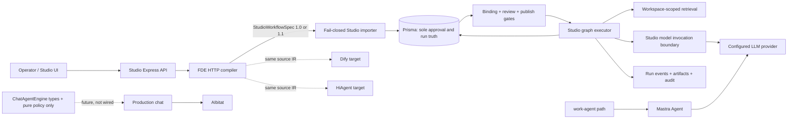

# Implemented architecture

## Ownership boundaries

| Boundary                                              | Owner                                              | Evidence                                                                                                                   |
| ----------------------------------------------------- | -------------------------------------------------- | -------------------------------------------------------------------------------------------------------------------------- |
| Requirement clarification and IR/compiler             | FDE                                                | `loom/service/routes/sessions.py`, `loom/runtimes/studio/v1/compiler.py`                                                   |
| Contract validation/import/diff                       | Studio                                             | `server/utils/fde/studioWorkflowSpec.js`, `server/utils/fde/studioWorkflowImporter.js`, `server/endpoints/fdeAuthoring.js` |
| Tenancy, binding, review, publication                 | Studio/Prisma                                      | `server/models/fdeWorkflowDraft.js`, `server/utils/fde/studioWorkflowBindings.js`                                          |
| Topologically ordered four-node DAG and interpolation | Studio graph executor                              | `server/utils/fde/studioWorkflowRunner.js`                                                                                 |
| Durable cursor, lease/CAS, billable-attempt result    | Studio/Prisma                                      | `server/models/fdeRunCheckpoint.js`, both Prisma schemas                                                                   |
| FDE LLM invocation                                    | configured Studio provider boundary                | `server/utils/fde/studioModelInvoker.js`, `server/utils/workAgent/modelRouter.js`                                          |
| Work-agent invocation                                 | Mastra remains supported outside FDE orchestration | `server/utils/workAgent/engine/mastraAdapter.js`                                                                           |
| Chat migration scaffold                               | Types and pure policy only; production is AIbitat  | `server/utils/chatAgent/`                                                                                                  |
| Events/artifacts/audit                                | Studio/Prisma and Studio storage                   | `server/models/runEvent.js`, `server/models/runArtifact.js`, FDE endpoints                                                 |

## Safety properties shown by the code

- Publication and run start recompute the review subject from fresh spec and
  bindings; Prisma is the only approval truth.
- A run persists its engine; it does not silently switch after a flag change.
- All retrieval is workspace-scoped in v1; arbitrary document handles fail
  closed at compile/import.
- The production subset is exactly manual trigger, retrieval, LLM, and output;
  condition, loop, parallel, and all other node/trigger/reference forms fail
  closed. Bare object interpolation is rejected; `${node.data}` is legal only
  for a declared JSON output binding.
- Checkpoint claims use an expiring lease/CAS and exclude terminal rows.
  Billable LLM output is stored under the attempt token before cursor advance.
- Artifacts, logs, event payloads, errors, checkpoint outputs, and metadata
  pass the named redaction boundaries.

Mastra workflow snapshots are intentionally absent. The architecture keeps
opaque external orchestration state from colliding with Studio's Prisma source
of truth.
